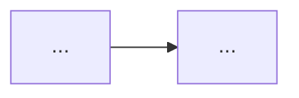

# Phase README

Rules:
- At most ~60 lines. Quick understanding, not full docs.
- Sections in exactly this order: Goal, Picture, What we built, Key terms, Test it in Studio.
- No code dumps, no long paragraphs, **no terminal commands for the user to run**.
- Plain language. Name exact files where it helps.
- The Mermaid diagram must be small (≤ ~12 nodes) and show what was built in this phase.
- Studio section: which graph to pick, 1–3 example inputs (the exact JSON to paste), which nodes run, which state fields change, where interrupts pause and how to resume.

Also add one line to the root README.md "Phases" list: `- Phase N — <name>: [README](docs/phases/PHASE_N_README.md)`.

## Template

````markdown
# Phase N — <Name>

## Goal
<One sentence.>

## Picture


## What we built
- <thing> → <why it matters>
- (5–8 bullets, one line each)

## Key terms
- **<term>**: <one plain-language line>
- (3–6 terms)

## Test it in Studio
1. Open graph **<name>**.
2. Paste input: `{"...": "..."}`
3. Watch: <nodes that run> · <state fields that change> · <where it pauses; how to resume>.
````
