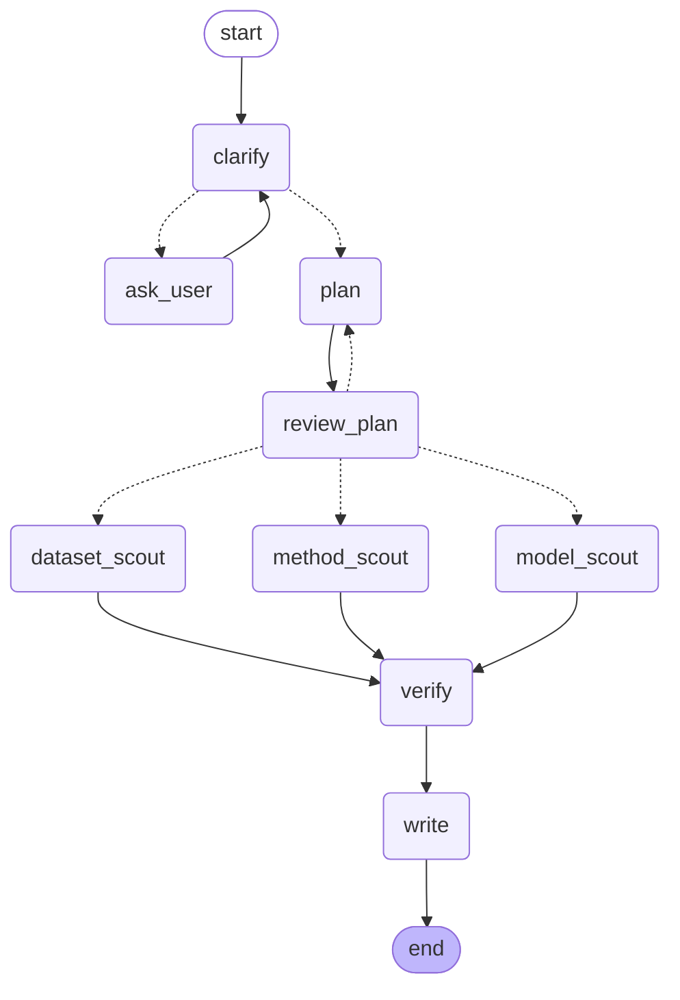

# HubScout

**An AI agent that turns "I want to build X" into a verified ML starter kit.**

Describe an ML task in plain English. HubScout searches the Hugging Face Hub, arXiv and the
web, checks every candidate **in code** against your licence, hardware and language needs, and
returns one README with up to **5 models, 5 datasets and 5 methods**, every link verified on
the day it ran.

[](https://github.com/2910Abhishek/HubScout/actions/workflows/ci.yml)


> **Status:** working proof of concept, verified end to end on live services. Runs locally on
> free resources (OpenRouter free models with a local Ollama fallback). Not hosted.

---

## Why

Choosing a model, a dataset and an approach for a new ML project takes hours: the Hugging Face
Hub alone has over 2 million models and 500,000+ datasets, licences and hardware fit are buried
in model cards, and Papers with Code (the main "task → methods → datasets" hub) shut down in
July 2025. General AI assistants answer in seconds, but their links can be stale, unsuitable or
invented.

HubScout's design principle: **the LLM proposes, code verifies.** Language models suggest
candidates; every fact that decides whether a candidate is shown comes from the Hugging Face
Hub, arXiv or a live HTTP check, and the decision is a plain, unit-tested rule.

---

## The LangGraph workflow

This diagram is generated from the compiled graph (`build_graph().get_graph().draw_mermaid()`).
Dotted arrows are conditional routes.



| Node | LLM? | What it does |
|---|---|---|
| `clarify` | ✓ | Extracts constraints (licence use, task type, hardware, languages); **code** decides which questions are still missing |
| `ask_user` | — | Human-in-the-loop interrupt: asks only the missing questions |
| `plan` | ✓ | Chooses the Hub task tag and the model, dataset and method search queries |
| `review_plan` | — | Interrupt: you approve the plan or send feedback for a revision |
| `model_scout` | ✓ | Tool-calling agent over the **official Hugging Face MCP server**; widens with a grounded search if results are thin |
| `dataset_scout` | — | Hub dataset search through the same MCP server |
| `method_scout` | — | Papers via Tavily (limited to arxiv.org) confirmed with the arXiv API; guides and repos via Tavily, SearXNG fallback |
| `verify` | — | Code-only checks (below), plus linking: datasets a chosen model was trained on and papers that describe it are read from its Hub card |
| `write` | ✓ | LLM picks method resources **from verified items only** and writes the summary; code builds and validates the kit and renders the README |

The three scouts run **in parallel** after plan approval and join at `verify`.

---

## How verification works

Every rule is a plain `if` statement over facts fetched from the source of truth:

| Item | Checked against | Rules |
|---|---|---|
| **Models** | Hugging Face Hub API | Exists; not gated; no `trust_remote_code`; not an adapter-only (LoRA) repo; licence on the allowlist for commercial use; task tag matches; memory fits (parameters × bytes per parameter × 1.2 at bf16 → int8 → int4); lists at least one required non-English language |
| **Datasets** | Hub API + dataset viewer | Exists; not gated; licence allowed; the viewer loads (sample rows come from it); has splits; an audio/image column for speech/vision tasks; same language rule |
| **Papers** | arXiv API | The arXiv ID exists (or its abstract page resolves) |
| **Web links** | Live HTTP request | Returns 2xx/3xx right now |

Anything that fails is dropped and listed in the README's **"What we ruled out"** with its reason.
The final `StarterKit` schema (Pydantic) enforces ≤ 5 items per section, ≤ 15 links and no duplicates.

---

## Example output

A real starter kit generated by HubScout, unedited:
**[Hindi–English speech-to-text, commercial use, 16 GB GPU →](docs/examples/hinglish-speech-to-text-starter-kit.md)**

It contains Whisper baselines and other speech models that fit a 16 GB GPU, licence-checked
datasets with sample rows, papers (one linked automatically from a model's Hub card), a
quick-start snippet, and every rejected candidate with its reason.

**Rough edges visible in this output** (fixes are planned in the
[project card, §13.1](docs/HubScout_Project_Card.md)):
- One dataset (ASCEND) is Mandarin–English; its card lists no languages, so it passed with a note instead of being rejected.
- Some "why" text is a raw search label, and one model's "why" (written by the scout LLM) says MIT where the verified licence column correctly says Apache-2.0.

---

## Engineering highlights

- **Human-in-the-loop** with LangGraph interrupts; resuming never repeats an LLM call, and empty answers are re-asked.
- **Runs on free tiers:** OpenRouter free models behind a **Redis-backed rate limiter** (20/min, 50/day, atomic Lua script), a hard per-call deadline, and automatic **fallback to a local Ollama model**.
- **Structured outputs everywhere:** every LLM output that feeds code is validated by Pydantic; the local model uses JSON-schema constrained decoding.
- **Hardened against real failures** found in live runs: rate limits, queued requests, API timeouts, network resets, and models answering in prose. Each now degrades gracefully instead of crashing.
- **Prompt-injection hygiene:** tool output is treated as untrusted data and size-capped; code, not the LLM, decides what is verified.
- **Quality gates:** 91 offline unit tests (fakes only, including the full graph through both interrupts), strict mypy, ruff, pre-commit with secret scanning, pip-audit, bandit, GitHub Actions CI.

---

## Tech stack

**Agent:** LangGraph, LangGraph Studio, LangChain (`ChatOpenAI`) ·
**LLMs:** OpenRouter (free models), Ollama (local fallback) ·
**Tools:** Hugging Face MCP server (`langchain-mcp-adapters`), `huggingface_hub`, Tavily, arXiv API, SearXNG ·
**Data:** Pydantic v2, pydantic-settings, Redis ·
**Infra:** Docker Compose, uv, Python 3.12 ·
**Quality:** pytest, mypy, ruff, pre-commit, detect-secrets, pip-audit, bandit, GitHub Actions

---

## Run it locally

Requirements: Python 3.12 with [uv](https://docs.astral.sh/uv/), Docker, and
[Ollama](https://ollama.com) with `qwen3:4b-instruct`. API keys: OpenRouter, LangSmith (for
Studio), Hugging Face and Tavily (all have free tiers).

```bash
uv sync                 # install dependencies
make env                # create .env (paste your API keys) and .env.infra (local passwords)
make up                 # start Redis, SearXNG and Postgres in Docker
make studio             # start the agent server on :2024
```

Open [LangGraph Studio](https://smith.langchain.com/studio/?baseUrl=http://127.0.0.1:2024),
choose **hubscout**, and enter a request such as:

```json
{"request": "Speech-to-text for Hindi-English customer calls. Commercial use. One 16 GB GPU."}
```

Each run's README is also saved to `outputs/`. All commands: [COMMANDS.md](COMMANDS.md).

---

## Project layout

```
app/
  graph/            LangGraph graph (build.py), state, prompts, nodes/
  tools/            Hugging Face MCP client, Hub/arXiv clients, web search, checks/
  schemas/          Pydantic models: constraints, plan, candidates, StarterKit
  report/           README renderer
  llm.py            OpenRouter + Ollama fallback, deadlines
  rate_limit.py     Redis rate limiter
tests/unit/         91 offline tests
docs/               project card, example output, progress
```

## Limitations

- Speed depends on free services: about 3 minutes with OpenRouter, 7–8 minutes when the local CPU model does everything.
- "Verified" means checked against what the registries report; a wrong model card can still mislead.
- The summary text is written by an LLM from verified facts and can still overstate.
- No benchmark against a search-enabled assistant yet (planned).

Full details, including what is planned but not built: **[Project card](docs/HubScout_Project_Card.md)**.

## License

MIT
