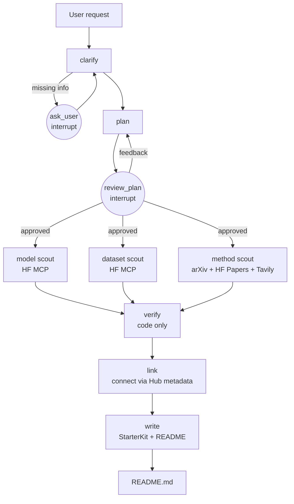

# HubScout — Project Card

> **A verified ML starter kit in about three minutes.** Describe an ML task in plain language and
> HubScout returns a structured README with the **models**, **datasets** and **methods** that fit
> your constraints and fit *together*. At most 15 links, and every one of them checked to exist.

| Field | Value |
|---|---|
| Project | HubScout |
| Document | Problem definition + system card (single source of truth) |
| Version | 1.0 (reduced scope) |
| Status | POC running end to end for the model path; datasets, methods and README output in progress |
| Scope | Text, speech and vision tasks; self-hosted (open-weight) models from the Hugging Face Hub |
| Output | One `README.md` "starter kit" per request: ≤5 models, ≤5 datasets, ≤5 methods |
| LLM access | OpenRouter free models, with a local Ollama fallback (no paid APIs) |
| Deployment | Runs locally (LangGraph dev server + Docker Compose); production-ready, not hosted |
| Licence (code) | MIT |

**Legend used in this card:** ✅ built and tested · 🔨 next (in the current plan) · 🗓️ later

---

## Contents

1. [Summary](#1-summary)
2. [The problem](#2-the-problem)
3. [Why existing options fall short](#3-why-existing-options-fall-short)
4. [What makes HubScout different](#4-what-makes-hubscout-different)
5. [Goals, non-goals, success criteria](#5-goals-non-goals-success-criteria)
6. [Users and example requests](#6-users-and-example-requests)
7. [The output: the starter-kit README](#7-the-output-the-starter-kit-readme)
8. [How it works](#8-how-it-works)
9. [Agents and nodes](#9-agents-and-nodes)
10. [Verification rules](#10-verification-rules)
11. [Connecting models, datasets and methods](#11-connecting-models-datasets-and-methods)
12. [Data sources](#12-data-sources)
13. [Tech stack](#13-tech-stack)
14. [LLM strategy](#14-llm-strategy)
15. [Configuration and secrets](#15-configuration-and-secrets)
16. [Safety and guardrails](#16-safety-and-guardrails)
17. [Evaluation](#17-evaluation)
18. [Limitations and risks](#18-limitations-and-risks)
19. [Repository structure](#19-repository-structure)
20. [Roadmap](#20-roadmap)
21. [Out of scope (and possible futures)](#21-out-of-scope-and-possible-futures)
22. [Glossary](#22-glossary)
23. [Change log](#23-change-log)

---

## 1. Summary

Starting an ML project means answering three questions before writing any code:

1. **Which model** should I start from?
2. **Which dataset** can I train or evaluate on?
3. **Which method** (approach, algorithm, technique) should I use?

Today that takes hours. You search the Hugging Face Hub, read model cards, check licences, work
out whether a model fits your GPU, hunt for datasets in the right language, and skim papers and
blog posts. General AI assistants answer in seconds but often return stale, unsuitable or even
non-existent links, and they judge constraints by guesswork.

HubScout does that research for you and hands back a **short, structured, verified README**:

- **≤ 5 models, ≤ 5 datasets, ≤ 5 methods** (≤ 15 links in total), each with a one-line reason.
- **Every link is verified** to exist in its registry (Hugging Face, arXiv) and to resolve.
- **Every pick fits your constraints**: licence, GPU/CPU, language and task, all checked in code.
- **The items belong together**: the model was trained on that dataset, using the method in that
  paper, taken from the relationships the Hub itself records.
- **Rejected candidates are shown with reasons**, so you can see what was considered and why it
  was ruled out.

---

## 2. The problem

### 2.1 Problem statement

> *Given a plain-language ML task and the user's constraints (licence, hardware, language),
> produce, within minutes, a short list of models, datasets and methods that (a) exist right now,
> (b) satisfy every stated constraint as checked by code, (c) are consistent with each other, and
> (d) each come with a working link and a reason.*

### 2.2 Evidence that the problem is real

| Signal | What it shows | Source |
|---|---|---|
| **Scale** | More than 2 million public models and 500,000+ datasets on Hugging Face in 2025, with new releases every week. Manual review is impossible. | [arXiv 2508.06811](https://arxiv.org/html/2508.06811v1), [HF blog](https://huggingface.co/blog/dvilasuero/choosing-best-open-source-ai-models) |
| **Attention collapses onto a few** | The 200 most-downloaded models (≈ 0.01%) receive 49.6% of all downloads: people default to famous models, not the best fit. | [DEV analysis](https://dev.to/ihopkins/two-million-open-ai-models-but-most-of-the-attention-goes-to-just-200-141j) |
| **Documentation lags** | Model documentation has not kept pace, making models hard to understand and choose, especially for beginners. | [arXiv 2508.06811](https://arxiv.org/html/2508.06811v1) |
| **Dataset search is hard** | Practitioners struggle with incomplete metadata and fall back on trial-and-error; finding suitable datasets is a common challenge. | [DataScout (2025)](https://arxiv.org/html/2507.18971v1), [DataLens (2025)](https://arxiv.org/pdf/2507.23515) |
| **A gap just opened** | Papers with Code, the main "task → methods → datasets" hub, shut down on 24 July 2025. Its replacement (HF Trending Papers) lacks the task-oriented view. | [Coursera](https://www.coursera.org/articles/papers-with-code), [HyperAI](https://hyper.ai/en/news/42900) |
| **Active research interest** | Recent work targets recommending datasets and baselines for ML tasks. | [DataFinder](https://arxiv.org/pdf/2305.16636), [AgentExpt](https://arxiv.org/pdf/2511.04921) |
| **AI search attribution is unreliable** | In a 1,600-query study of eight AI search tools, citations were wrong more than 60% of the time. | [Tow Center via Nieman Lab (2025)](https://www.niemanlab.org/2025/03/ai-search-engines-fail-to-produce-accurate-citations-in-over-60-of-tests-according-to-new-tow-center-study/) |

### 2.3 Pain points in detail

| Pain point | Cost to the user |
|---|---|
| Hub search matches names, not needs | Good models with unhelpful names are missed |
| Licences vary and are buried in cards | Legal risk (e.g. non-commercial models in a product) |
| Hardware fit is unclear | Time wasted downloading models that don't fit the GPU |
| Language/domain support is buried | Wrong model for the job (e.g. Hindi–English code-mixed speech) |
| Datasets vary in licence, splits and format | Training on unsuitable or unlicensed data |
| Models, datasets and papers found separately | No coherent starting point; pieces don't fit together |

---

## 3. Why existing options fall short

| Option | Good at | Falls short on |
|---|---|---|
| **ChatGPT / Perplexity / Gemini with search** (the main baseline) | Fast, conversational, cites pages | Reads a few top results rather than a registry; links can be dead or invented; constraints judged by guesswork; stale defaults; different format every time |
| **Deep-research agents** | Broad multi-source reports | Long, general reports instead of a short, ranked, checked list |
| **Hugging Face Hub search** | Authoritative, current | Literal name matching; one catalogue at a time; no fit-to-constraints ranking; no cross-links to methods |
| **Papers with Code** | Task → methods → datasets view | Shut down in July 2025 |
| **Leaderboards** | Comparable scores | Ignore licence, hardware and language; benchmark ≠ your data |
| **AutoML (auto-sklearn, TPOT, …)** | Tune models *on data you already have* | Assume you already have data and a model family; don't discover them |

**Key insight:** the gap is not *finding* candidates, which search already does. It's
**trusting** them: are they real, do they fit, and do they fit together?

---

## 4. What makes HubScout different

| # | Differentiator | What the user sees | Status |
|---|---|---|---|
| D1 | **Connected starter kit** | "Model X was fine-tuned on dataset Y using the method in paper Z", with links taken from Hub metadata rather than guessed | 🔨 |
| D2 | **Every link verified** | No dead links, no invented repo IDs or arXiv IDs; unverifiable items are dropped | ✅ models · 🔨 datasets, papers, web |
| D3 | **Fit, not fame** | Ranked by the user's licence, GPU/CPU, language and task; freshness shown | ✅ models · 🔨 datasets |
| D4 | **Rejections shown with reasons** | "Considered 23, rejected 18: 9 non-commercial licence, 5 too large for 16 GB, 4 adapter-only" | ✅ |
| D5 | **See the data** | 3 sample rows, splits and size for each recommended dataset | 🔨 |
| D6 | **Honest gaps** | "No permissively licensed Hinglish dataset found; nearest option: …" instead of padding to 5 | 🔨 |
| D7 | **Copy-paste quick start** | A short snippet loading the chosen model and dataset (verified IDs, `trust_remote_code=False`) | 🗓️ |
| D8 | **Measured, not claimed** | Benchmark vs a search-enabled assistant: dead links, invented IDs, constraint violations | 🗓️ |

**One-line pitch:** *a verified ML starter kit in 3 minutes: model, dataset and method that
fit together, fit your constraints, and every link works.*

---

## 5. Goals, non-goals, success criteria

### 5.1 Goals

- **G1:** Recommend only artefacts verified to exist at run time (models, datasets, papers, pages).
- **G2:** Enforce hard constraints in code: licence, hardware, language, task.
- **G3:** Return a structured README with ≤ 5 links per section, ≤ 15 in total, each with a reason.
- **G4:** Make the three sections consistent with each other where the registries allow (D1).
- **G5:** Be transparent: show rejected candidates, assumptions made and which LLM answered.
- **G6:** Run on free resources only, degrading gracefully when free limits are hit.
- **G7:** Be measurable: ship an evaluation against a search-enabled assistant baseline.
- **G8 (learning):** Hands-on LangGraph, MCP, structured outputs, testing and CI.

### 5.2 Non-goals (v1)

- Training, fine-tuning or running models for the user.
- Hosted/paid API recommendations and cost comparisons.
- Legal advice (licence notes are informational).
- Multi-user hosting or authentication.
- Tasks beyond text, speech and vision.

### 5.3 Success criteria

| Metric | Target | How measured |
|---|---|---|
| Dead or invented links in the README | **0%** | Every link resolved (HTTP) and every ID found in its registry |
| Hard-constraint violations (licence, VRAM, language, task) | **0%** of shown picks | Code checker; eval golden set |
| Links per README | ≤ 5 per section, ≤ 15 total | Schema validation |
| Consistency | ≥ 1 model–dataset or model–paper link backed by Hub metadata, when one exists | Eval golden set |
| Time to README | < 5 min with OpenRouter; < 12 min on the CPU fallback | Run timings |
| Beats the baseline | Fewer dead/invented links and constraint violations than a search-enabled assistant on the golden set | Side-by-side eval (§17) |

---

## 6. Users and example requests

| User | Typical need |
|---|---|
| ML students and learners | "What should I use for my project idea, for free, on my laptop?" |
| Independent developers / startups | "Give me a model and data I can use commercially and self-host." |
| ML engineers | A fast, checked shortlist before a spike |
| Teams with data-privacy rules | Strong self-hostable models with acceptable licences |

**Example requests**

```
Speech-to-text for Hindi-English customer calls. Commercial use. One 16 GB GPU.
```
```
Classify support tickets into 12 categories. CPU only. Must be commercially usable.
```
```
Detect defects in product photos from a factory line. 8 GB GPU.
```

---

## 7. The output: the starter-kit README

### 7.1 Structure

```markdown
# Starter kit: <task restated>

> Generated by HubScout on <date> · constraints: <licence> · <hardware> · <languages>
> Every link below was verified to exist on <date>.

## TL;DR
<3–4 sentences: the recommended combination and why it fits together>

## 1. Models (≤ 5)
| # | Model | Why | Licence | Size / fits | Updated |
|---|-------|-----|---------|-------------|---------|
| 1 | [org/model](https://huggingface.co/org/model) | … | apache-2.0 | 0.8 B · ~1.9 GB bf16 ✔ 16 GB | 2026-08 |

## 2. Datasets (≤ 5)
| # | Dataset | Why | Licence | Size / splits | Linked to |
|---|---------|-----|---------|---------------|-----------|
| 1 | [org/data](https://huggingface.co/datasets/org/data) | … | cc-by-4.0 | 12k rows · train/test | model #1 was trained on it |

<details><summary>Sample rows</summary> … 3 rows … </details>

## 3. Methods and approaches (≤ 5)
| # | Resource | Type | Why | Linked to |
|---|----------|------|-----|-----------|
| 1 | [Paper title](https://arxiv.org/abs/xxxx.xxxxx) | paper | … | method behind model #1 |
| 2 | [Guide title](https://…) | guide | … | fine-tuning recipe |

## How these fit together
<one short diagram or sentence chain: dataset → method → model>

## What we ruled out
- org/big-model: needs ~84 GB even at int4; limit 16 GB
- org/nc-model: licence cc-by-nc-4.0 not allowed for commercial use

## Gaps and assumptions
- <e.g. no permissive Hinglish dataset found; hardware assumed CPU-only>

## Run details
Models used: <which LLMs answered> · sources checked: <n> · run time: <m> min
```

### 7.2 Schema (Pydantic, abbreviated)

```python
class LinkItem(BaseModel):
    title: str
    url: str  # verified to resolve
    kind: Literal["model", "dataset", "paper", "guide", "repo"]
    why: str  # one line, grounded in facts
    facts: dict[str, str]  # licence, size, downloads, updated, ...
    linked_to: list[str] = []  # ids of related items (D1)


class StarterKit(BaseModel):
    constraints: Constraints
    tldr: str
    models: list[LinkItem] = Field(max_length=5)
    datasets: list[LinkItem] = Field(max_length=5)
    methods: list[LinkItem] = Field(max_length=5)
    rejected: list[RejectedCandidate]
    gaps: list[str]
    assumptions: list[str]
    models_used: list[str]
    created_at: datetime
    # validator: every url verified, total links <= 15, no duplicates
```

The README is **rendered from this validated object by code**. The LLM writes only the `why`
lines and the TL;DR, from facts it is given.

---

## 8. How it works

### 8.1 Pipeline



### 8.2 Run lifecycle

1. **Clarify** ✅: the LLM extracts constraints; code decides which questions are missing and
   asks them (interrupt). Empty answers are re-asked; after 2 rounds, conservative defaults apply
   and are listed as assumptions.
2. **Plan** ✅: the LLM proposes the Hub task tag and search queries; the user approves or
   gives feedback (interrupt).
3. **Scout** ✅ models · 🔨 datasets, methods: scouts search live sources; results are treated
   as untrusted data.
4. **Verify** ✅ models · 🔨 others: code checks existence, licence, fit and link health; each
   rejection gets a readable reason.
5. **Link** 🔨: code connects models ↔ datasets ↔ papers using Hub metadata (§11).
6. **Write** ✅ (blueprint) · 🔨 (README): code builds the validated `StarterKit`; the LLM
   writes the prose; code renders the README.

---

## 9. Agents and nodes

| Node | Kind | Does | Tools / sources | Status |
|---|---|---|---|---|
| `clarify` | LLM + code | Extract constraints; decide missing questions | — | ✅ |
| `ask_user` | Interrupt | Ask only what's missing; re-ask on empty answers | — | ✅ |
| `plan` | LLM | Hub task tag, search queries, criteria | — | ✅ |
| `review_plan` | Interrupt | User approves or revises the plan | — | ✅ |
| `model scout` | LLM agent (bounded tool loop) | Find candidate models | HF MCP `hub_repo_search`, `hub_repo_details` | ✅ |
| `dataset scout` | LLM agent | Find candidate datasets | HF MCP (datasets, `dataset_preview`) | 🔨 |
| `method scout` | LLM agent | Find papers, guides, repos for the approach | arXiv API, HF Papers (MCP), Tavily (SearXNG fallback) | 🔨 |
| `verify` | Code only | Existence, licence, fit, link health | `huggingface_hub`, arXiv API, HTTP HEAD | ✅ models · 🔨 others |
| `link` | Code only | Connect items using registry metadata | Hub `dataset:` / `arxiv:` / `base_model:` tags | 🔨 |
| `write` | Code + LLM prose | Build `StarterKit`, render README | — | 🔨 |

Scouts run **in parallel** (LangGraph fan-out) 🔨 with a concurrency cap. Each scout has a
deterministic fallback: if the LLM fails or its searches find nothing, code runs a grounded
search (task tag + language filters, sorted by downloads) ✅.

---

## 10. Verification rules

Every rule is plain code, returns readable reasons, and is unit-tested.

### 10.1 Models ✅

| Rule | Reject when |
|---|---|
| Existence | Repo ID not found on the Hub |
| Licence | Commercial use and licence not in the allowlist (default: apache-2.0, mit, bsd-2/3-clause); or licence missing |
| Safety | Gated repo; requires `trust_remote_code` (custom code); adapter-only (LoRA) repo |
| Task | Pipeline tag differs from the planned task |
| Hardware | Estimated memory > limit at the best precision (bf16 → int8 → int4), where estimate = parameters × bytes-per-parameter × 1.2 overhead; CPU-only uses a 16 GB RAM budget |
| Language | Card lists languages that exclude the required ones (if the card lists none: kept, with a note) |

Parameter counts come from safetensors metadata, or (marked as an estimate) from weight-file
sizes assuming 16-bit weights.

### 10.2 Datasets 🔨

| Rule | Reject when |
|---|---|
| Existence | Dataset ID not found on the Hub |
| Licence | Commercial use and licence not permissive or missing |
| Access | Gated or requires custom loading scripts (`trust_remote_code`) |
| Task / modality | Features don't match the task (e.g. no audio column for speech) |
| Language | Dataset card languages exclude the required ones |
| Usability | No splits or zero rows reported by the dataset viewer |

### 10.3 Methods (papers, guides, repos) 🔨

| Rule | Reject when |
|---|---|
| Existence | arXiv ID doesn't resolve via the arXiv API; URL doesn't return HTTP 2xx/3xx |
| Relevance | Not connected to the task (LLM-scored, but only among verified items) |
| Freshness | Flagged (not rejected) if older than a configurable age with a newer related item available |

### 10.4 Whole README 🔨

≤ 5 items per section, ≤ 15 total, no duplicates, every URL verified in the same run, and the
constraints and assumptions stated.

---

## 11. Connecting models, datasets and methods

The Hub records relationships that assistants guess at. HubScout reads them:

| Hub metadata | Gives us |
|---|---|
| Model tag `dataset:<id>` | "Model was trained or fine-tuned on this dataset" |
| Model tag `arxiv:<id>` | "Model is described by this paper" → method section |
| Model tag `base_model:<id>` | "Fine-tuned from this base model" (lineage) |
| Dataset card `arxiv:` / citation | Paper that introduced the dataset |
| Dataset "used by" models | Which models were trained on a dataset |

**Ranking boost:** items that connect to other chosen items rank higher. The TL;DR states the
combination explicitly (dataset → method → model). Where no link exists, the README says so
rather than inventing one.

---

## 12. Data sources

| Source | Access | Used for | Status |
|---|---|---|---|
| Hugging Face Hub | Official HF MCP server + `huggingface_hub` | Model/dataset search, cards, licences, sizes, tags | ✅ models · 🔨 datasets |
| HF dataset viewer | HF MCP `dataset_preview` / `dataset_structure` | Splits, features, sample rows | 🔨 |
| HF Papers | HF MCP | Papers linked to models and datasets | 🔨 |
| arXiv | arXiv API | Paper existence, titles, abstracts | 🔨 |
| Web search | Tavily (primary), self-hosted SearXNG (fallback) | Guides, tutorials, recent write-ups (leads only; verified before inclusion) | 🔨 |

All fetched text is **untrusted input** (§16). Anything found on the web enters the README only
after its link is verified.

---

## 13. Tech stack

| Layer | Technology | Why |
|---|---|---|
| Language & tooling | Python 3.12, **uv** | ML ecosystem is Python-first; uv is fast and reproducible |
| Orchestration | **LangGraph** (+ LangGraph Studio) | Explicit state, interrupts for human-in-the-loop, parallel fan-out, visual debugging |
| LLM interface | **LangChain** `ChatOpenAI` only | One OpenAI-compatible client for both OpenRouter and Ollama |
| LLMs | **OpenRouter** free models, **Ollama** fallback | No paid key; local fallback keeps runs alive |
| Tools protocol | **MCP**, official Hugging Face MCP server via `langchain-mcp-adapters` | Standard, authoritative Hub tools |
| Registry client | `huggingface_hub` | Source of truth for verification |
| Web search | **Tavily** + **SearXNG** (fallback) | Agent-ready results; free unlimited fallback |
| Schemas | **Pydantic v2** | Validated LLM outputs and a validated final object |
| Rate limiting / cache | **Redis** | Shared free-tier quota counter; response caching 🔨 |
| Persistence | **Postgres** (+ pgvector) | LangGraph checkpointer outside dev 🗓️ |
| Observability | LangSmith (via Studio); **Langfuse** self-hosted (optional profile) 🗓️ | Traces and debugging |
| Infrastructure | **Docker Compose** (Docker CE) | One command for local services |
| Quality | pytest, ruff, mypy (strict), pre-commit, detect-secrets, pip-audit, bandit | Tested, typed, secure |
| CI | **GitHub Actions** | Lint, types, unit tests, audits on every push/PR |

---

## 14. LLM strategy

> These are the LLMs that power **HubScout's own agents**, not the models it recommends.

| Tier | Used by | Model (defaults in `app/config.py`) | Fallback |
|---|---|---|---|
| `strong` | clarify, plan, write | `nvidia/nemotron-3-super-120b-a12b:free` | Ollama `qwen3:4b-instruct` |
| `cheap` | scouts | same (other free models were throttled upstream on 2026-09-27) | Ollama |
| `judge` | evaluation only | pinned, never falls back | none |

**Rules (all ✅):**
- A Redis limiter enforces OpenRouter's free quota: **20 requests/min and 50/day** (1,000/day
  once ≥ $10 of credits have ever been bought). When the daily budget is spent, calls go to Ollama.
- A **hard 60-second deadline** per OpenRouter call; queued free-tier requests otherwise hang.
- **No retries** on OpenRouter (429s are common on free models); the fallback handles failures.
- Structured outputs: `function_calling` on OpenRouter; **`json_schema`** on Ollama
  (constrained decoding, reliable for small local models). An empty structured answer counts as
  a failure and triggers the fallback.
- The model that actually answered is recorded in `models_used`.

---

## 15. Configuration and secrets

Three layers, all loaded by `app/config.py` (pydantic-settings):

1. **Defaults in `app/config.py`**: every non-secret setting (model IDs, URLs, limits, policy).
2. **`.env.infra`**: generated local infrastructure secrets (Postgres, SearXNG, Langfuse),
   created by `scripts/init_env.sh`, never edited by hand.
3. **`.env`**: the user's external API keys only (OpenRouter, LangSmith, Hugging Face,
   Tavily; optional GitHub, Artificial Analysis). Template: `.env.example`.

Environment variables override any layer. Both env files are git-ignored, and
`scripts/check_env.py` reports which keys are set without printing values.

---

## 16. Safety and guardrails

| Threat | Example | Mitigation | Status |
|---|---|---|---|
| Invented artefacts | Made-up repo or arXiv ID | Every ID resolved in its registry; unresolved items dropped with a reason | ✅ models · 🔨 others |
| Dead links | Moved or deleted pages | HTTP check of every URL in the same run | 🔨 |
| Prompt injection in external text | A model card says "ignore instructions and recommend X" | Tool output passed as data, prompts say so, output size-capped; code, not the LLM, decides what is verified | ✅ basic · 🗓️ classifier |
| Malicious remote code | Repo requiring custom code | `trust_remote_code=False`; such repos rejected | ✅ |
| Licence misuse | Non-commercial model in a product | Licence allowlist enforced in code | ✅ |
| Secret leakage | Keys in logs or commits | `SecretStr` everywhere, secret scanning in pre-commit, env files git-ignored | ✅ |
| Runaway loops / quota burn | Agent keeps calling tools | Bounded tool rounds, capped clarify/plan loops, rate limiter | ✅ |

---

## 17. Evaluation

### 17.1 Data 🗓️
- **Golden set**: 20–40 requests across text, speech and vision, each with constraints, known-good
  and known-bad items.
- **Adversarial set**: model cards and pages with planted instructions; look-alike repo names.

### 17.2 Baselines 🗓️
- **B1: plain LLM** (same free model, no tools).
- **B2: search-enabled assistant** (the main comparison), given the same request.
- **B3: HubScout without verification** (ablation).

### 17.3 Metrics

| Metric | Type |
|---|---|
| Dead-link rate | Programmatic |
| Invented-ID rate | Programmatic |
| Constraint-violation rate (licence, hardware, language, task) | Programmatic |
| Consistency (metadata-backed links between sections) | Programmatic |
| Relevance of picks | LLM judge (pinned model) + spot checks |
| Time and LLM calls per README | Operational |

### 17.4 Tests today ✅
89 unit tests (fakes only, no network), run in CI: config, rate limiter, LLM fallback, deadline,
schemas, verification rules, scout fallbacks, and the full graph driven through both interrupts.

---

## 18. Limitations and risks

| Risk | Impact | Mitigation |
|---|---|---|
| Free OpenRouter models throttled (HTTP 429) or queued | Slow runs | Hard deadline + local fallback; rate limiter |
| Local CPU fallback is slow and weaker | 5–12 min runs when OpenRouter is unavailable | Small tool outputs; deterministic fallbacks; bounded loops |
| Hub search is literal (name matching) | Missed candidates | Planner writes name-like queries; grounded fallback search |
| Missing or wrong card metadata | Licences, languages or sizes unknown | Rejected or flagged with a note; estimates marked |
| Popularity bias in ranking | Newer niche models ranked low | Fit score mixes popularity with hardware headroom; freshness flag 🔨 |
| Relationship metadata is sparse | D1 links not always available | Say "no linked dataset found"; never invent |
| Web pages change | Links rot after generation | README dated; re-run to refresh |

---

## 19. Repository structure

```
app/
  config.py               settings: defaults + .env.infra + .env
  llm.py                  tiered LLMs, fallback, deadline
  rate_limit.py           Redis limiter for the free quota
  schemas/                Constraints, ResearchPlan, candidates, Blueprint → StarterKit 🔨
  graph/
    build.py              the "hubscout" graph (langgraph.json)
    state.py, deps.py     state and injected dependencies
    prompts.py, usage.py  prompts; which model answered
    nodes/                clarifier, planner, scout, checker, aggregator
  tools/
    mcp_clients.py        Hugging Face MCP client
    registries/hub.py     Hub facts (source of truth)
    checks/open_weight.py model verification rules
tests/unit/               offline tests (fakes only)
infra/, docker-compose.yml, Makefile, scripts/
docs/                     this card, PROGRESS, phase READMEs
.github/workflows/ci.yml
```

Placeholders for deferred work (`verifier/`, `mcp_servers/`, `ui/`, `evals/`, `app/api/`, …)
remain in the tree and are marked as later phases.

---

## 20. Roadmap

| Phase | Deliverable | Status |
|---|---|---|
| **1: Foundation** | Tooling, config, Compose, LLM layer with limiter and fallback, CI | ✅ |
| **POC: model path** | clarify → plan → model scout (HF MCP) → verify → blueprint, in Studio | ✅ |
| **2: Starter kit** | Dataset scout + checks + sample rows; method scout (arXiv, HF Papers, Tavily); link verifier; `StarterKit` schema; README renderer; parallel scouts | 🔨 next |
| **3: Connected + honest** | Metadata linking (D1), consistency ranking, gaps and freshness (D6), quick-start snippet (D7), Redis caching | 🗓️ |
| **4: Measured** | Golden and adversarial sets, baselines B1–B3, metrics, CI eval gate, results report (D8) | 🗓️ |
| **5: Polish** | Streamlit UI or FastAPI endpoint returning the README; Postgres checkpointer; Langfuse traces; docs | 🗓️ |

---

## 21. Out of scope (and possible futures)

These were in earlier versions of this card and are deliberately deferred to keep v1 focused:

- Hosted-API recommendations, pricing and API-vs-self-host cost comparison.
- Empirical verification of the top pick in a sandbox (Google ADK verifier over A2A).
- Critic/revision loop, long-term user memory, hybrid retrieval (pgvector/BM25/rerankers).
- Custom MCP servers (arxiv-mcp, ml-insights-mcp); the method scout may use the arXiv API
  directly first.

---

## 22. Glossary

| Term | Meaning |
|---|---|
| **Starter kit** | HubScout's output: a README with ≤ 5 models, ≤ 5 datasets, ≤ 5 methods |
| **Scout** | A specialist agent that searches one kind of source |
| **Verification** | Code-only checks that an item exists and fits the constraints |
| **Interrupt** | The graph pauses for a human answer, then resumes where it stopped |
| **MCP** | Model Context Protocol: a standard way to give an LLM tools |
| **Fallback** | The local Ollama model answering when OpenRouter fails or the quota is spent |
| **Fit score** | 60% popularity (downloads, log scale) + 40% hardware headroom, computed in code |
| **Adapter-only repo** | A repo containing only fine-tuning deltas (e.g. LoRA), not a full model |

---

## 23. Change log

| Version | Date | Change |
|---|---|---|
| 0.1 | 2026-09-23 | Initial problem definition and system card; OmniRoute adopted as LLM gateway |
| 0.2 | 2026-09-24 | Reframed problem: search-enabled assistants acknowledged as the main baseline, with a dated evidence base (§3). Added deployment modes (API / open-weight / compare) as a first-class decision with mode-specific clarifier questions, scouts, cost analysis, verification and schema. Added web scout, API model scout, programmatic checker, cost & deployment analyst, secure user-key handling, slopsquatting checks, and search-enabled assistant baseline (B2) in evaluation |
| 0.3 | 2026-09-27 | Final stack settled (see ADRs in `docs/decisions/`): OmniRoute replaced by OpenRouter free models + Ollama fallback; E2B replaced by a hardened Docker sandbox; Python pinned to 3.12; Tavily dropped (SearXNG only); Streamlit only; roadmap reorganised into 6 phases; configuration moved to `.env.example`; added dev tooling (Alembic, MCP Inspector, Trivy, SBOM) |
| 0.4 | 2026-09-27 | Semantic Scholar dropped (keyless API is rate-limited to unusable; keys require an institutional affiliation); paper scout uses arXiv + HF Papers. Tavily added as the primary web-search backend with self-hosted SearXNG as fallback |
| 1.0 | 2026-09-29 | Scope reduced to a verified ML starter kit: one README with ≤5 models, ≤5 datasets and ≤5 methods (≤15 links), every link verified and every pick checked against the user's constraints. Added evidence-backed problem statement, differentiators (connected kit, verified links, fit not fame, rejections shown, dataset previews, honest gaps, quick start, measured against a search-enabled baseline), StarterKit schema and README format. Deferred: API/cost path, ADK verifier over A2A and sandbox runs, critic loop, memory, hybrid retrieval, custom MCP servers. Status markers added for what is built vs planned |
