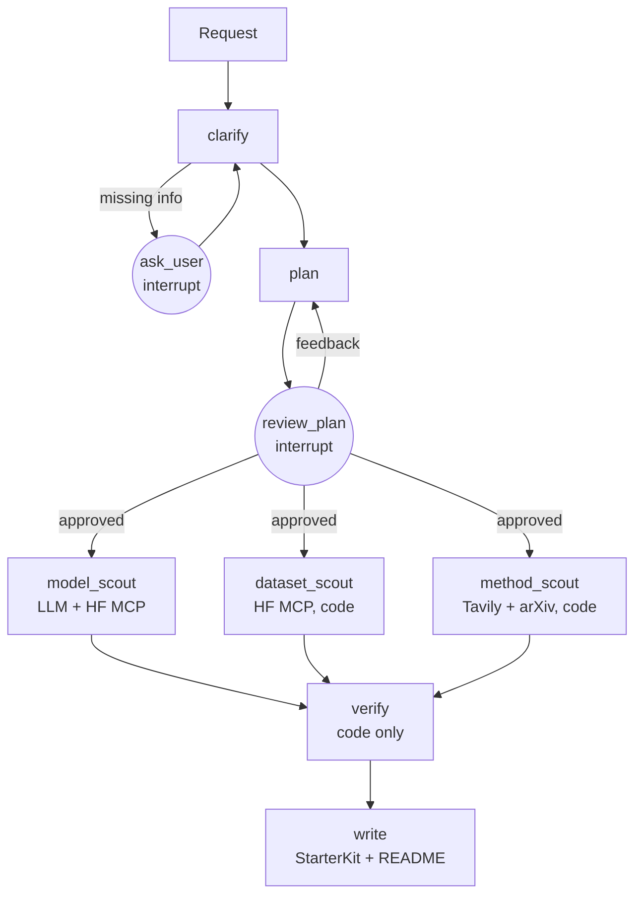

# HubScout — Project Card

> **Describe an ML task in plain English; get back a short, verified starter kit.**
> HubScout searches the Hugging Face Hub, arXiv and the web, checks every candidate **in code**
> against your licence, hardware and language needs, and writes one README with at most
> 5 models, 5 datasets and 5 methods. Every link in it was checked to exist on the day it ran.

| Field | Value |
|---|---|
| Version | 1.2 (honest status as of 2026-10-06; §13.1 lists planned output-quality changes) |
| Status | **Working proof of concept.** Full pipeline verified live end to end; runs locally |
| Scope | Text, speech and vision tasks; self-hosted (open-weight) models from the Hugging Face Hub |
| Output | A Markdown README "starter kit" (≤ 5 models, ≤ 5 datasets, ≤ 5 methods, ≤ 15 links) |
| Cost | Free resources only: OpenRouter free models, local Ollama fallback, free API tiers |
| Deployment | Local only (LangGraph dev server + Docker Compose). Not hosted |
| Code | Branch `phase-2-starter-kit`, not yet merged to `main` or pushed |

This card describes **only what exists and works today**. Planned work is listed separately
in §13 and §14, and is never described as done.

---

## 1. The problem

Before writing any ML code you must choose a **model**, a **dataset** and a **method**. Doing it
well takes hours:

- **Scale:** the Hugging Face Hub has over 2 million models and 500,000+ datasets
  ([arXiv 2508.06811](https://arxiv.org/html/2508.06811v1)).
- **Popularity bias:** the top 200 models (about 0.01%) get roughly half of all downloads
  ([analysis](https://dev.to/ihopkins/two-million-open-ai-models-but-most-of-the-attention-goes-to-just-200-141j)).
- **Dataset search is hard:** practitioners rely on trial and error with incomplete metadata
  ([DataScout, 2025](https://arxiv.org/html/2507.18971v1)).
- **A gap opened:** Papers with Code, the main "task → methods → datasets" hub, shut down in
  July 2025 ([Coursera](https://www.coursera.org/articles/papers-with-code)).
- **AI search assistants answer fast but can be wrong:** in one study, AI search tools got
  citations wrong more than 60% of the time
  ([Tow Center via Nieman Lab](https://www.niemanlab.org/2025/03/ai-search-engines-fail-to-produce-accurate-citations-in-over-60-of-tests-according-to-new-tow-center-study/)).

**HubScout's angle:** the hard part is not finding candidates, but **trusting** them. Do they
exist, do they fit my constraints, and do they fit together?

---

## 2. What it does today (verified)

1. **Asks only what's missing.** If the request doesn't say whether use is commercial, what
   the task type is, or what hardware is available, it pauses and asks (one round of up to 3
   questions; empty answers are re-asked).
2. **Shows a research plan for approval.** You approve it, or give feedback and get a revised
   plan.
3. **Searches three sources in parallel:** models (an LLM agent using the official Hugging Face
   MCP server), datasets (Hub search through the same MCP server) and methods (papers and guides
   from the web via Tavily, with arXiv).
4. **Verifies everything in code**, with no LLM judgement involved (§5).
5. **Connects the pieces:** datasets a chosen model was trained on, and papers that describe
   it, are read from the model's Hub card and added to the kit.
6. **Writes the README:** tables for each section, sample rows for datasets, a quick-start
   snippet, "what we ruled out" with reasons, gaps and assumptions, and which LLM answered.

### Example (real run, 2026-09-30)

Request: *"Speech-to-text for Hindi-English mixed customer calls. Commercial use. We want to run
it ourselves on one 16 GB GPU."*

| Section | Result |
|---|---|
| Models (5) | Hinglish speech-recognition models, e.g. `moorlee/qwen3-asr-0.6b-hinglish`, `dkubeio/DKube-asr-hinglish-v1-0.8B`; all Apache-2.0 or MIT, ~1.9 GB each (fit 16 GB) |
| Datasets (2) | `agarwalayushi/hinglish` (Hindi + English, CC-BY-4.0, linked: a chosen model was trained on it), `google/svq` |
| Methods (5) | Qwen3-ASR Technical Report and Polyglot-Lion (both linked automatically from model cards), two code-switching ASR papers, one guide |
| Ruled out | 12 candidates, each with a reason (e.g. gated, non-commercial licence, adapter-only repo) |
| Run time | 457 s, entirely on the local CPU fallback model (that day's OpenRouter quota was used up); an earlier run on OpenRouter took 194 s |

---

## 3. What makes it different (built and working)

| Differentiator | What you see |
|---|---|
| **Verified links** | Every model and dataset is confirmed on the Hub; every paper is confirmed on arXiv; every web link is fetched and must resolve |
| **Fit, not fame** | Licence, GPU/CPU memory, task and language are checked in code before anything is shown |
| **Rejections with reasons** | "What we ruled out" lists each rejected candidate and why |
| **Connected kit** | Datasets and papers linked from the chosen models' Hub cards are pulled in; linked datasets rank first |
| **See the data** | Up to 3 sample rows plus splits and row counts for each dataset |
| **Honest gaps** | Empty sections say so (with the nearest rejected option) instead of padding |
| **Quick start** | A short snippet using only verified IDs and `trust_remote_code=False` |

---

## 4. How it works

### 4.1 Pipeline (the `hubscout` LangGraph graph)



### 4.2 Nodes

| Node | Uses an LLM? | What it does |
|---|---|---|
| `clarify` | Yes (extraction) | LLM extracts constraints; **code** decides which questions are missing; keyword backup for task type |
| `ask_user` | No | Interrupt: asks the missing questions; re-asks on empty answers |
| `plan` | Yes | Hub task tag plus model, dataset and method search queries |
| `review_plan` | No | Interrupt: approve, or give feedback for a revised plan (max 2 revisions) |
| `model_scout` | Yes (tool loop, max 3 rounds) | Searches the Hub via HF MCP (`hub_repo_search`, `hub_repo_details`); if fewer than 3 candidates, code runs a grounded search (task + languages, by downloads) |
| `dataset_scout` | No | Hub dataset search via HF MCP with the planned queries, then task/language filters |
| `method_scout` | No | Papers: Tavily limited to arxiv.org, confirmed by arXiv ID lookup (arXiv search as fallback). Guides/repos: Tavily (SearXNG fallback) |
| `verify` | No | All checks in §5; pulls linked datasets and papers from Hub metadata |
| `write` | Yes (2 calls) | LLM picks method resources **from verified items only** and writes the TL;DR from verified facts; code builds and validates the kit and renders the README |

About 8–10 LLM calls per run. Both LLM steps in `write` have code fallbacks.

---

## 5. Verification rules (all in code, no LLM)

**Models**
- Exists on the Hub; not gated; doesn't need `trust_remote_code`; not an adapter-only (LoRA) repo
- Licence: for commercial use, must be on the allowlist (Apache-2.0, MIT, BSD-2/3-Clause); missing licence → rejected
- Task: the model's pipeline tag must match the planned task
- Memory: parameters × bytes per parameter × 1.2, at the best precision that fits
  (bf16 → int8 → int4); CPU-only uses a 16 GB RAM budget. Parameter counts come from safetensors
  metadata, or are estimated from weight-file sizes (flagged as an estimate)
- Language: the card must list at least one required **non-English** language (English alone
  doesn't satisfy a Hindi-English request); a card that lists no languages gets a note

**Datasets**
- Exists; not gated; licence allowed (allowlist plus permissive data licences such as CC-BY-4.0, CC0)
- The Hub's dataset viewer must work (otherwise it can't be inspected); splits must exist
- Modality: speech datasets need an audio column, vision datasets an image column
- Same language rule as models

**Methods**
- arXiv papers: the ID is confirmed by the arXiv API, or by its abstract page resolving if the API is unavailable
- Web links: fetched now; must return HTTP 2xx/3xx (HEAD, then GET if HEAD is refused)

**Whole kit:** at most 5 per section and 15 links in total, no duplicates; an empty kit must explain its gaps.

**Ranking:** models by a fit score (60% popularity on a log scale, 40% hardware headroom), with
a small boost if linked to a verified dataset; datasets linked to a chosen model first, then by
popularity.

---

## 6. Reliability (added after failures in live runs)

| Problem seen live | What HubScout does now |
|---|---|
| Free OpenRouter models return HTTP 429 or queue for minutes | Hard 60 s deadline per call, no retries, then fall back to local Ollama |
| Daily free quota (50 calls) spent | Redis limiter knows the count; calls go straight to Ollama |
| Small local model answers in prose instead of the required structure | Ollama uses JSON-schema constrained output; an empty result counts as a failure |
| One Hub request reset by the network | Hub lookups retry once; on failure only that item is marked "could not verify" |
| arXiv search timing out / rate limiting all day | Papers come from Tavily (arxiv.org only) and are confirmed by ID lookup or abstract page |
| Narrow searches return one candidate | Grounded search widens the model list; scout picks are topped up from search results |
| HF MCP server unreachable | Scouts continue with an empty result and record the error |

---

## 7. Tech stack actually in use

| Area | Technology | Role |
|---|---|---|
| Language | Python 3.12, uv | Project and dependencies |
| Agent | LangGraph + LangGraph Studio | Graph, interrupts, parallel scouts; visual testing |
| LLM client | LangChain `ChatOpenAI` | One client for OpenRouter and Ollama |
| LLMs | OpenRouter free model `nvidia/nemotron-3-super-120b-a12b:free`; Ollama `qwen3:4b-instruct` (CPU) | Primary and fallback |
| Hub tools | Official Hugging Face MCP server via `langchain-mcp-adapters`; `huggingface_hub`; HF dataset viewer API | Search and verification |
| Papers / web | Tavily; arXiv API; SearXNG (self-hosted fallback) | Methods section |
| Data validation | Pydantic v2 (+ pydantic-settings) | Every LLM output and the final kit are validated |
| Rate limiting | Redis | Shared quota counter |
| Infrastructure | Docker Compose (Docker CE) | Redis, SearXNG, Postgres, optional Langfuse |
| Quality | pytest, ruff, mypy (strict), pre-commit, detect-secrets, pip-audit, bandit | Tests, lint, types, security |
| CI | GitHub Actions workflow | Written, but not yet run on GitHub (nothing pushed) |

**Running but not used by the graph yet:** Postgres + pgvector (for saved runs later) and
Langfuse (starts healthy under the `observability` profile, but traces aren't wired in).

---

## 8. Configuration and secrets

- **`.env`**: your API keys only (OpenRouter, LangSmith, Hugging Face, Tavily; optional GitHub,
  Artificial Analysis). Template: `.env.example`.
- **`.env.infra`**: generated local passwords (Postgres, SearXNG, Langfuse); never edited by hand.
- **Defaults**: every other setting lives in `app/config.py`.
- Keys are `SecretStr` (never printed); env files are git-ignored; secret scanning runs on every commit.

---

## 9. Testing and quality (honest)

| What | Status |
|---|---|
| Unit tests | **91 passing**, offline with fakes: config, rate limiter, LLM fallback and deadline, model checks, language rule, scout fallbacks, and the full graph through both interrupts (parallel scouts, linking, dead-link rejection, gaps, README) |
| Not yet unit-tested directly | Dataset checks, arXiv client, web search, link checker, README renderer, Hub dataset-facts path (they are exercised only through the graph test's fakes and the live runs) |
| Integration tests | None yet (`tests/integration/` is empty); live checks were run by hand |
| Types / lint | mypy strict on `app/`: clean; ruff: clean |
| Live end-to-end runs | Several on 2026-09-30 through the dev server; the last one completed with no errors |

---

## 10. Limitations and known issues

- **Speed depends on free services:** about 3 minutes with OpenRouter, 7–8 minutes when the
  local CPU model does everything.
- **One free model:** only Nemotron answered reliably during testing, so both LLM tiers use it.
- **50 OpenRouter calls/day** without credits: roughly 5 full runs before falling back to Ollama.
- **arXiv API was unreliable** during testing; papers rely on Tavily (1,000 free credits/month,
  about 6 per run).
- **Hub search matches names literally,** so good models with unhelpful names can be missed.
- **Popularity still influences ranking;** newer niche models can rank low.
- **The narrative LLM** is limited to verified facts, but its prose can still overstate (e.g.
  "fine-tuned on extensive data"). The latest fix for this was verified by unit tests, not yet by
  a live run.
- **Many good speech datasets are gated** (e.g. Common Voice variants) and are rejected by design.
- LangGraph logs a warning that Pydantic types in checkpoints are "unregistered" (harmless now).

---

## 11. How to run

See [COMMANDS.md](../COMMANDS.md). In short: `make up`, `make studio`, then open
https://smith.langchain.com/studio/?baseUrl=http://127.0.0.1:2024 and pick **hubscout**.
Each run's README is saved in `outputs/`.

---

## 12. Repository structure

```
app/
  config.py, llm.py, rate_limit.py      settings, LLM tiers + fallback, quota limiter
  schemas/                              constraints, plan, candidates, StarterKit
  graph/                                build.py (graph), state, deps, prompts, nodes/
  tools/
    mcp_clients.py                      Hugging Face MCP client
    registries/hub.py, arxiv.py         Hub + dataset viewer facts; arXiv client
    search.py                           Tavily + SearXNG
    checks/                             model, dataset, language and link checks
  report/readme.py                      README renderer + quick start
tests/unit/                             91 offline tests
infra/, docker-compose.yml, Makefile, scripts/, COMMANDS.md
docs/                                   this card, PROGRESS, phase READMEs
```

Empty placeholder packages for deferred work (`verifier/`, `mcp_servers/`, `ui/`, `evals/`,
`app/api/`, `app/memory/`, `app/retrieval/`, `app/guardrails/`) remain in the tree.

---

## 13. Next steps (not built yet)

### 13.1 Planned: output quality (v1.2)

The section limits stay (at most 5 each), but the aim becomes **fewer, better, different
items**. Reviewing the real output (§2) showed four problems, each with a planned fix:

| Problem seen in real output | Planned fix |
|---|---|
| **Models repeat:** 3 of 5 were variants of one model family from one author; no well-known baseline to compare against | At most 1 model per author / base family; always include 1 strong, widely used baseline, then the best specialised fine-tunes (3–5 in total) |
| **Datasets thin:** only 2 shown; many good speech datasets hidden because they are gated or have no viewer | Gated or viewer-less datasets that exist are listed under **"Needs access"** (verified, with a note) instead of being hidden; aim for 2–4 directly usable ones |
| **Methods mixed:** an off-topic paper (Singapore ASR) came in through a model card link; no practical guide or code | Fixed roles: 1 foundational paper, 1 recent method, 1 practical fine-tuning guide, 1 code repository; linked papers must also match the task and language |
| **Weak "why" text:** raw search labels and paper abstracts instead of reasons | One short, specific reason per item, written from verified facts (licence, size, trained-on, downloads); never a raw snippet |

Expected cost: about one extra LLM call per run (for the reasons); the rest is code.

### 13.2 Later

1. Unit tests for the untested modules (§9) and live integration tests.
2. Code review, merge to `main`, tag, and push (with your approval).
3. **Benchmark against a search-enabled assistant** (dead links, invented IDs, constraint
   violations) on 20–40 example requests.
4. A simple UI (Streamlit) or API, so others can try it without Studio.
5. Saved runs (Postgres checkpointer) and Langfuse tracing.

## 14. Out of scope (deferred from earlier versions)

Hosted-API recommendations and cost comparison; running the top pick in a sandbox (Google ADK
verifier over A2A); critic loop; long-term memory; hybrid retrieval; custom MCP servers.

---

## 15. Glossary

| Term | Meaning |
|---|---|
| Starter kit | The output README: ≤ 5 models, ≤ 5 datasets, ≤ 5 methods |
| Scout | A node that searches one kind of source |
| Verification | Code-only checks that an item exists and fits the constraints |
| Interrupt | The graph pauses for your answer, then continues where it stopped |
| MCP | Model Context Protocol: a standard way to give an LLM tools |
| Fallback | The local Ollama model answering when OpenRouter can't |
| Adapter-only repo | A repo with only fine-tuning deltas (e.g. LoRA), not a full model |

---

## 16. Change log

| Version | Date | Change |
|---|---|---|
| 0.1 | 2026-09-23 | Initial problem definition and system card; OmniRoute adopted as LLM gateway |
| 0.2 | 2026-09-24 | Reframed problem: search-enabled assistants acknowledged as the main baseline, with a dated evidence base (§3). Added deployment modes (API / open-weight / compare) as a first-class decision with mode-specific clarifier questions, scouts, cost analysis, verification and schema. Added web scout, API model scout, programmatic checker, cost & deployment analyst, secure user-key handling, slopsquatting checks, and search-enabled assistant baseline (B2) in evaluation |
| 0.3 | 2026-09-27 | Final stack settled (see ADRs in `docs/decisions/`): OmniRoute replaced by OpenRouter free models + Ollama fallback; E2B replaced by a hardened Docker sandbox; Python pinned to 3.12; Tavily dropped (SearXNG only); Streamlit only; roadmap reorganised into 6 phases; configuration moved to `.env.example`; added dev tooling (Alembic, MCP Inspector, Trivy, SBOM) |
| 0.4 | 2026-09-27 | Semantic Scholar dropped (keyless API is rate-limited to unusable; keys require an institutional affiliation); paper scout uses arXiv + HF Papers. Tavily added as the primary web-search backend with self-hosted SearXNG as fallback |
| 1.0 | 2026-09-29 | Scope reduced to a verified ML starter kit: one README with ≤5 models, ≤5 datasets and ≤5 methods (≤15 links), every link verified and every pick checked against the user's constraints. Added evidence-backed problem statement, differentiators (connected kit, verified links, fit not fame, rejections shown, dataset previews, honest gaps, quick start, measured against a search-enabled baseline), StarterKit schema and README format. Deferred: API/cost path, ADK verifier over A2A and sandbox runs, critic loop, memory, hybrid retrieval, custom MCP servers. Status markers added for what is built vs planned |
| 1.1 | 2026-10-06 | Rewritten to describe only what is built and verified: actual pipeline and nodes, implemented verification rules, reliability fixes from live runs, real example output, honest test coverage, limitations, and a separate list of what is not built |
| 1.2 | 2026-10-06 | Added planned output-quality changes (§13.1): diverse models with a baseline, "Needs access" datasets, role-based methods, fact-based reasons. Not built yet |
