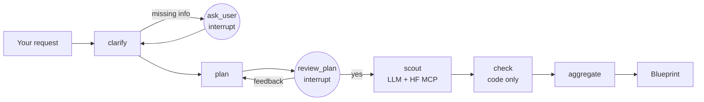

# POC — Open-weight path, end to end

## Goal
Turn a plain-language ML task into a verified open-weight model recommendation, live in Studio.

## Picture

## What we built
- `app/graph/build.py` graph "hubscout" → the whole pipeline, visible node by node in Studio
- Clarifier (`nodes/clarifier.py`) → LLM extracts facts, **code** decides what to ask
- Planner + approval (`nodes/planner.py`) → you approve or correct the plan before any search
- Scout (`nodes/scout.py`) → LLM searches the Hub through the official Hugging Face MCP server
- Checker (`tools/checks/open_weight.py`) → existence, licence, VRAM, task, language checked in code
- Aggregator (`nodes/aggregator.py`) → code builds the Blueprint; LLM only writes the prose
- LLM layer (`app/llm.py`) → OpenRouter free model, Redis rate limit, Ollama fallback

## Key terms
- **Interrupt**: the graph pauses and waits for your answer, then resumes where it stopped.
- **MCP**: a standard way to give an LLM tools; here, Hub search from Hugging Face's own server.
- **Fallback**: if OpenRouter fails or the daily quota is spent, the local Ollama model answers.
- **Checker verdict**: every candidate is approved or rejected with readable reasons, no LLM.
- **Fit score**: 60% popularity (downloads) + 40% hardware headroom, computed in code.

## Test it in Studio
Open: https://smith.langchain.com/studio/?baseUrl=http://127.0.0.1:2024 → graph **hubscout**.

1. Full info (skips questions, pauses at plan approval):
   `{"request": "Speech-to-text for Hindi-English customer calls. Commercial use. Self-hosted on one 16 GB GPU."}`
2. Missing info (pauses with questions first):
   `{"request": "Classify support tickets into 12 categories."}`
   → resume with e.g. `Self-hosted, commercial, CPU only, text`
3. API mode (skips scouting, explains the API path is pending):
   `{"request": "Summarise legal contracts using a hosted API, commercial use."}`

Watch:
- **Interrupts**: `ask_user` shows `questions`; `review_plan` shows `plan`. Resume with `yes`,
  or with feedback text to get a revised plan.
- **State**: `constraints`, `plan`, `scout_messages` (every MCP tool call and result),
  `candidates`, `approved` / `rejected` (with reasons), `blueprint`, `models_used`.
- **Speed**: about 1-3 minutes per run. If `models_used` shows `qwen3:4b-instruct`, the local
  CPU fallback answered (slower). OpenRouter's free tier allows 50 calls/day (~7 per run).
